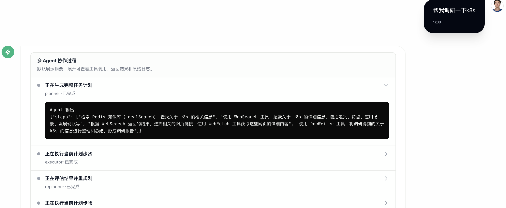
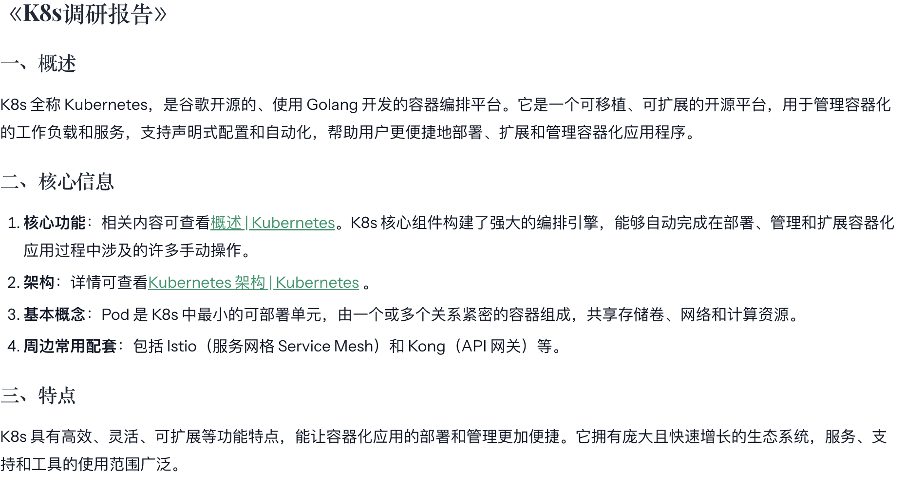
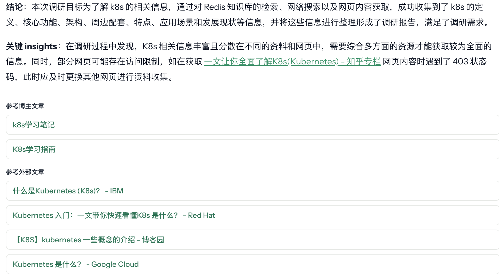
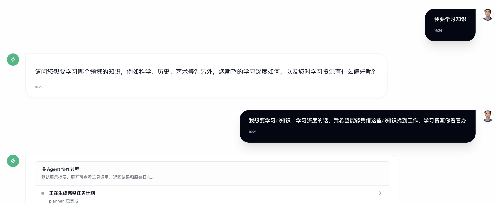

# WenDao 个人博客框架

一个可以直接 fork、支持 GitHub Actions 自动部署、也支持本地 `docker compose` 一键启动的个人博客框架。

`WenDao` 不是只给自己用的博客站点，它把博客前台、内容管理、评论系统、登录系统、可选 AI 能力和部署流程都打包好了。别人克隆仓库后，可以直接跑起一套自己的个人博客，再在现有视觉和组件基础上调整内容、品牌和样式。

## 效果展示

| AI 多 Agent 协作过程 | 效果展示 2 |
| --- | --- |
|  |  |

| 效果展示 3 | 效果展示 4 |
| --- | --- |
|  |  |

## 这套框架适合什么

- 想快速搭一个能公开访问的个人博客
- 想要现成的管理后台、文章编辑和评论系统
- 想保留一个统一的视觉风格，再按自己的习惯改文案、头像、导航、主题色
- 想保留 AI 助手、知识检索和多 Agent 能力作为增强模块，而不是从零自己拼

## 部署方式

默认提供两种方式。

### 方式一：GitHub Actions 自动部署

推荐给对外发布的正式站点。

流程是：

1. Fork 或 clone 这个仓库
2. 配好服务器、数据库、域名和各类密钥
3. 推送到 `main`
4. GitHub Actions 自动拉取最新代码
5. 服务器端执行 `docker compose up -d --build`

适合希望“推到 `main` 就完成部署”的个人博客站点。

### 方式二：本地或服务器一键启动

适合本地预览、内网部署或临时服务器启动。

```bash
docker compose --env-file .env.production -f docker-compose.prod.yml -f docker-compose.ip.yml up -d --build
```

如果你要正式域名和自动 HTTPS，用 `docker-compose.prod.yml` 即可；如果只是 IP 访问，可以配合 `docker-compose.ip.yml`。

## 克隆后，通常只需要改这些地方

这是框架化最重要的一层。你可以保持当前视觉风格，只替换自己的内容。

- 站点标语和站点地址：`backend/config/config.yaml`、`.env.production`
- 首页顶部文案：`frontend/src/components/home/ArticlePlanetOverlay.tsx`
- 网站标题与导航品牌：`frontend/src/components/common/Header.tsx`
- 页脚联系信息：`frontend/src/components/common/Footer.tsx`
- 站点主题和交互细节：`frontend/src/styles/`、`frontend/tailwind.config.js`
- 文章、分类、评论、个人资料和封面图：后台管理界面直接维护
- AI / GitHub 登录 / 邮箱：通过环境变量配置即可启用，不需要改业务代码

如果你只想做一个“自己的博客”，先改站点信息和联系方式就够了。AI 助手、多 Agent 和知识文档模块都可以保留，也可以先不配置。

## 你会得到什么

- 博客前台：文章浏览、分类筛选、Markdown 渲染、评论互动
- 内容后台：文章管理、分类管理、评论管理、知识文档审核
- 个性化入口：网站标语、头像、用户名、联系方式、主题色、首页文案
- 自动化部署：GitHub Actions + 服务器端 Docker 构建
- 本地启动：`docker compose` 一条命令起服务
- 可选增强：AI 对话、RAG 检索、研究型多 Agent 流程

## 快速开始

### 1. 启动后端

```bash
cd backend
go run ./cmd/server
```

默认端口：`8089`

### 2. 启动前端

```bash
cd frontend
npm ci
npm run dev
```

默认地址：`http://localhost:3000`

前端开发服务器会将 `/api` 与 `/uploads` 代理到后端。

## 本地开发命令

### Backend

```bash
cd backend
go test ./...
go build ./cmd/server
go fmt ./...
```

### Frontend

```bash
cd frontend
npm run dev
npm run build
npm run lint
npm run preview
```

## 配置说明

后端主要读取 `backend/config/config.yaml`，并支持使用 `backend/config/.env` 或环境变量覆盖。

常见环境变量包括：

- `DB_HOST`
- `DB_PORT`
- `DB_USER`
- `DB_PASSWORD`
- `DB_NAME`
- `JWT_SECRET`
- `AI_PROVIDER`
- `AI_API_KEY`
- `AI_ENDPOINT`
- `AI_CHAT_MODEL`
- `DOUBAO_API_KEY`
- `DOUBAO_ENDPOINT`
- `DOUBAO_CHAT_MODEL`
- `DOUBAO_EMBEDDING_MODEL`
- `GITHUB_CLIENT_ID`
- `GITHUB_CLIENT_SECRET`
- `GITHUB_CALLBACK_URL`
- `REDIS_HOST`
- `REDIS_VECTOR_HOST`
- `EMAIL_SMTP_HOST`
- `EMAIL_FROM_ADDRESS`
- `EMAIL_USERNAME`
- `EMAIL_PASSWORD`
- `SITE_URL`

其中 `AI_PROVIDER` 用来切换聊天模型提供商，当前支持 `doubao`、`deepseek` 和 `openai-compatible`。向量模型仍然默认使用豆包，不需要为切换聊天模型额外改动知识库配置。

前端可通过 `frontend/.env` 指定：

```env
VITE_API_BASE_URL=/api
```

## 如何把它改成你自己的博客

建议按这个顺序来：

1. 先改 `backend/config/config.yaml` 和 `.env.production`
2. 再改 `frontend/src/components/common/Header.tsx` 和 `Footer.tsx`
3. 替换首页文案、社交链接和头像
4. 发表几篇自己的文章，调整分类和封面图
5. 确认 GitHub Actions 能在你的服务器上自动部署

这样你会得到一套“保留现有风格，但内容完全属于你”的个人博客，而不是从零搭一个站。

## 当前能力

- 博客文章发布与展示
- 分类与评论管理
- 后台内容编辑
- 用户注册、登录与 GitHub OAuth
- AI 聊天与流式输出
- 基于向量检索的知识召回
- 多 Agent 研究过程展示
- 知识文档审核与沉淀
- 应用日志与 AI 聊天日志支持大小轮转、压缩和历史保留天数清理

## 项目结构

```text
wenDao/
├── backend/                    # Go 后端
│   ├── cmd/server/             # 服务入口
│   ├── config/                 # 配置文件与环境变量
│   ├── internal/
│   │   ├── handler/            # HTTP 处理层
│   │   ├── middleware/         # 中间件
│   │   ├── model/              # 数据模型
│   │   ├── repository/         # 数据访问层
│   │   ├── service/            # 业务逻辑与 AI 编排
│   │   └── pkg/                # 公共基础能力
│   ├── uploads/                # 本地上传目录
│   └── migrations/             # 数据迁移相关
├── frontend/                   # React 前端
│   ├── src/api/                # API 请求封装
│   ├── src/components/         # 通用与业务组件
│   ├── src/pages/              # 页面级入口
│   ├── src/views/              # 视图实现
│   ├── src/store/              # Zustand 状态
│   ├── src/hooks/              # 自定义 Hooks
│   └── src/styles/             # 全局样式
├── docs/                       # 核心设计文档与部署指南
├── examples/                   # 实验性示例
└── scripts/                    # 辅助脚本
```

## Notes

- 仓库中不应提交真实的 `.env`、日志、上传文件和本地构建产物
- 前端子项目说明见 [frontend/README.md](./frontend/README.md)
- 部署细节见 [docs/deployment.md](./docs/deployment.md)

## License

当前仓库尚未声明独立 License；如需开源发布，建议补充明确的许可证文件。
